About
=====

Git is one of the most helpful tools a developer can have at his or her
disposal. It practically gives you super powers, allowing you to roll
back undesirable changes, quickly switch between development tasks, and
organize all of your projects - for free.\
\

Downloading Github Desktop
==========================

The first thing you should do for this lab, is download the Github
Desktop client from https://desktop.github.com/. *If you are on Linux,
you will have to use either GitKraken, or the Command Line Interface
(CLI) for this lab. Ask a TA if you need help.*\
\

Initialize a Repository
=======================

1.  Click on “Create new repository”.\
    \
    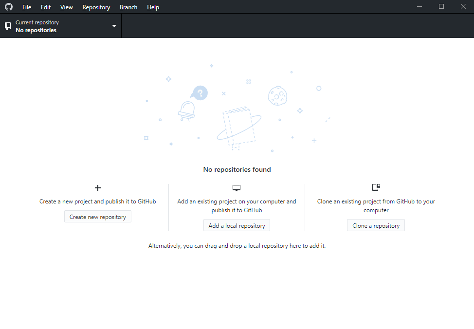

2.  Fill in the following pieces of information:

    1.  Name: hello\_world

    2.  Description: Intro hello world program for Git

    3.  Local path: *Wherever you want to save it*.

    4.  Check “Initialize this repository with a README”.

    5.  Choose C++ for the Git Ignore file

    6.  Licence: MIT *This doesn’t matter, I encourage you to look at
        https://choosealicense.com/ if you are in doubt*

        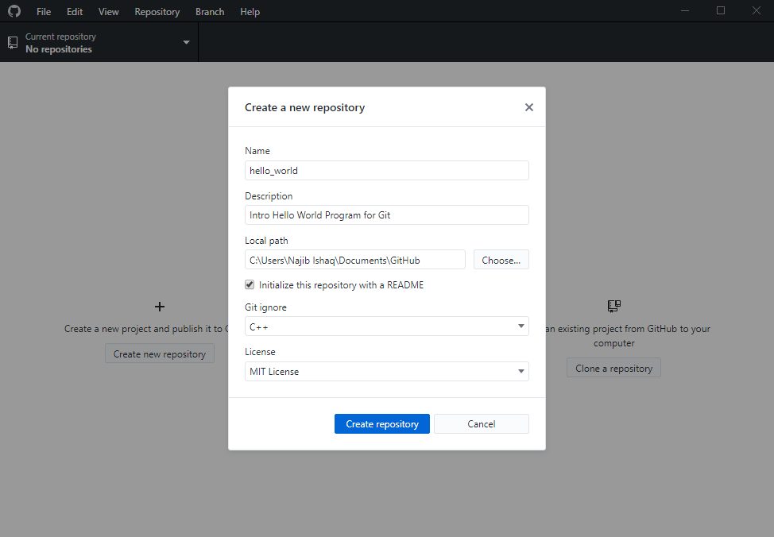

3.  Click “Create repository”

4.  *Wait*

5.  Once the initialization is complete, navigate to the folder you have
    created and examine the contents.\
    \
    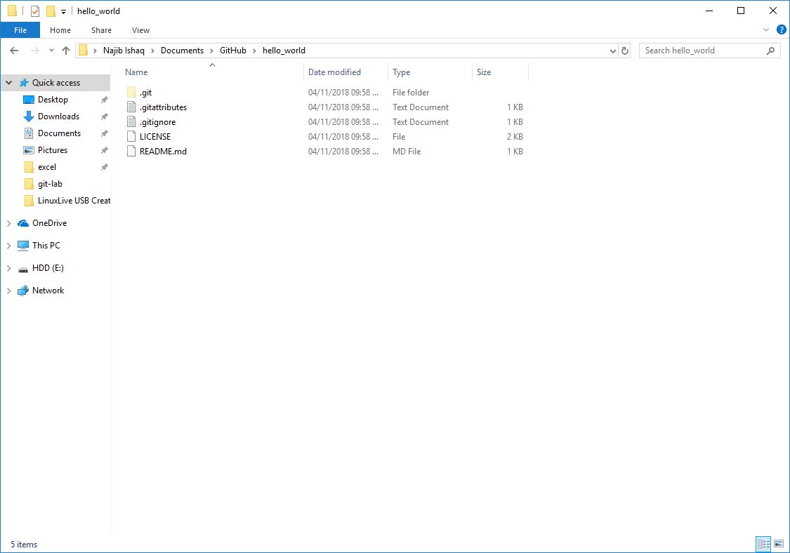

READMEs
=======

README files are considered a common courtesy among programmers. They
are normally written in *Markdown:
(https://github.com/adam-p/markdown-here/wiki/Markdown-Cheatsheet)*, a
deceptively simple language that can allow you to convey details about
your program to anyone who’s interested.\
\
For this lab, your README, along with the Git Log, will be your
submission. It is your job to write a thoughtful, and properly formatted
README, containing details about what you have done for today’s lab.\
\
Start by listing yourself as the author, today’s date, and your lab
section. Now write an **About** section using header-level two.

Commits
=======

In Git, saved changes are called *Commits*. Now that you’ve made changes
to your README, navigate back to the Github Desktop Client, and take a
moment to examine what the software is presenting you.\
\
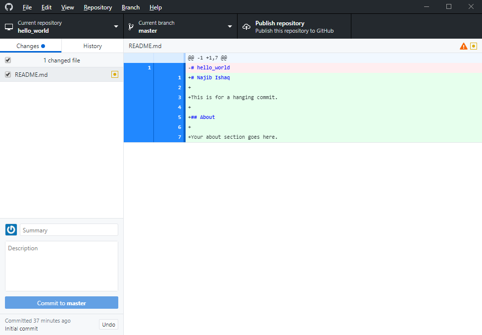\
On the right, you will see a *Git Diff*, where lines added are
highlighted in green, and lines removed are highlighted in red. Now, add
a message to the left-hand panel, and commit the changes to master. Note
that the description for this change is optional, modifying the README
is self-evident, **other changes will not be**.

History
=======

Once you have committed this change, click over to the history tab and
take a look at the graphical interpretation of the current Git Log for
the repository. There should be two commits at this point, one for the
initial commit, and one with your initial README modifications. If this
is not the case please let a TA know.\
\
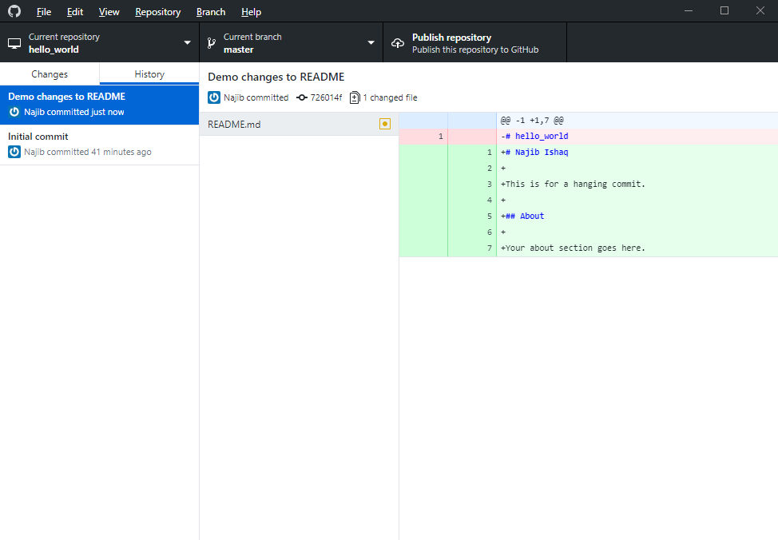 

Publishing your work
====================

Now select *Publish Repository*, look over the suggested settings, and
hit *Publish repository* once you are satisfied that the options fit
your needs (hint: they normally are).\
\
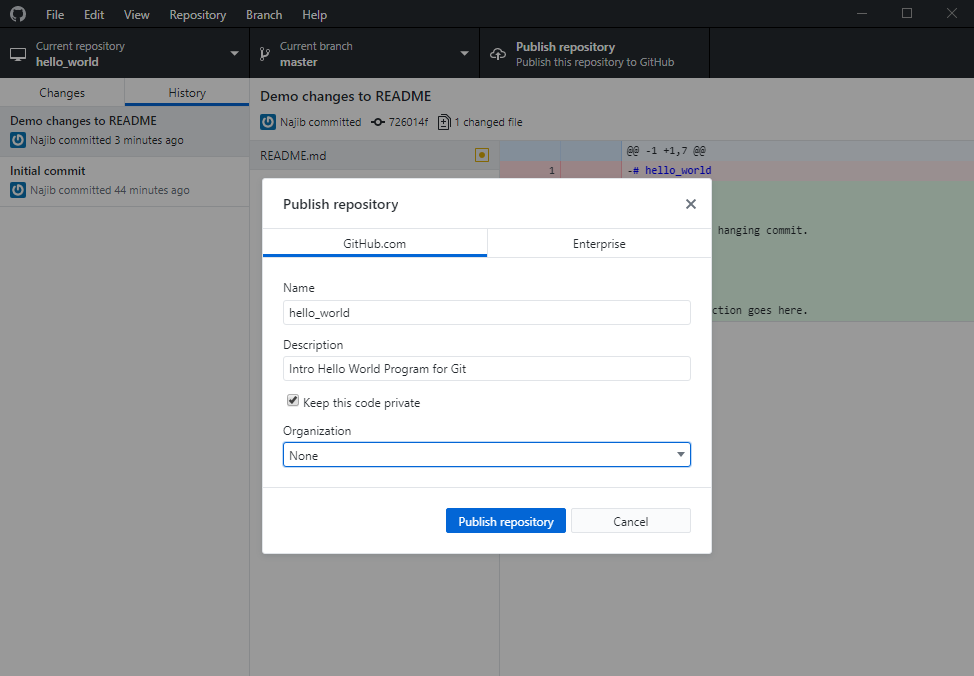\
\
You may notice, at this point, the “Keep this code private” option; this
is highly valuable while you are a student, as it lets you host your
assignments on Github, and not violate any academic codes. As students,
you get unlimited private repositories for free, after signing up for
the Github Student Pack (https://education.github.com/pack).\
\
If you are anything like your TAs you will be eternally grateful for the
online copies of your work when your system inevitably crashes fatally
the night before a project is due.

Branching
=========

Branching in Git is, essentially, a way to maintain multiple copies of
code, at the same time. Many developers use branches to test new
features in parallel, cooperate on new ideas, and generally develop in a
safe manner. If you branch, attempt a new solution, and horribly
mess-up, **you can *check out* another branch will bring you back to a
functional state within moments**.\
\
To create a new branch:

1.  Select *Current Branch*, and fill in a new branch name (it doesn’t
    matter what the branch itself is called).

    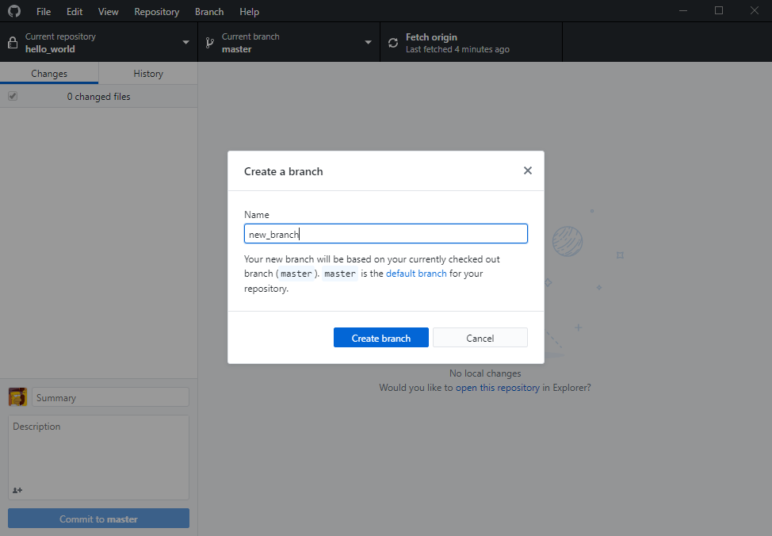

2.  Once you have filled in an appropriate name, select *Create Branch*

Now, let’s add some files to our project!

1.  Navigate back to the folder, and create a new `main.cc` file.

2.  Create a program that writes “Hello World!” to the command line.

Finally, let’s commit these changes to our new branch.

1.  Navigate back to the Github Application.

2.  Look at the new diff that is presented, once you agree with the
    changes, write a new commit message, and commit the changes you’ve
    made to your new branch.\
    \
    

Once you have finalized your commit, publish the branch (using the same
button you used to publish the repository).\

Merging
=======

Merging changes allows you to take changes from branches and *merge*
them with the *master* branch. To do this in your repository, first
select “Current Branch”, and select *master*.\
\
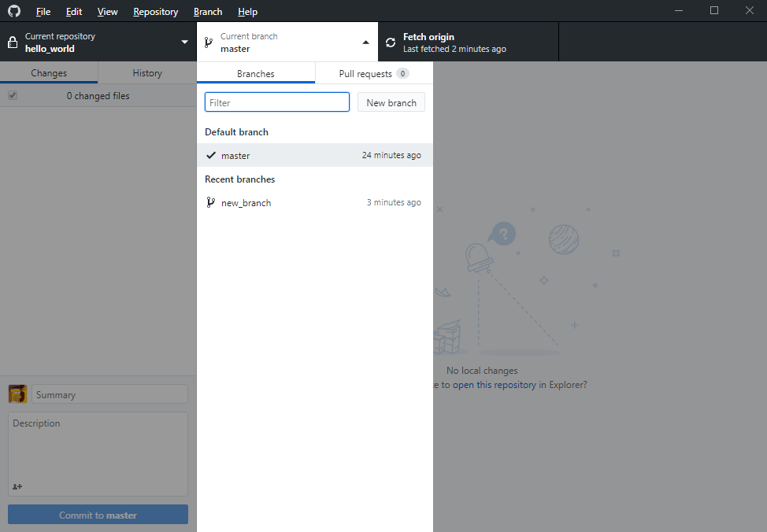\
\
Now, select “Branch” from the top menu, and select “Merge into current
branch”. Then, select the branch you’ve just made, and click “Merge into
Master”. Once the changes have been merged into the master branch, you
must **push** these changes to Github. To do this, select “Push to
origin” from the top menu. Once it is done loading, navigate to
Github.com and examine your new repo!\
\
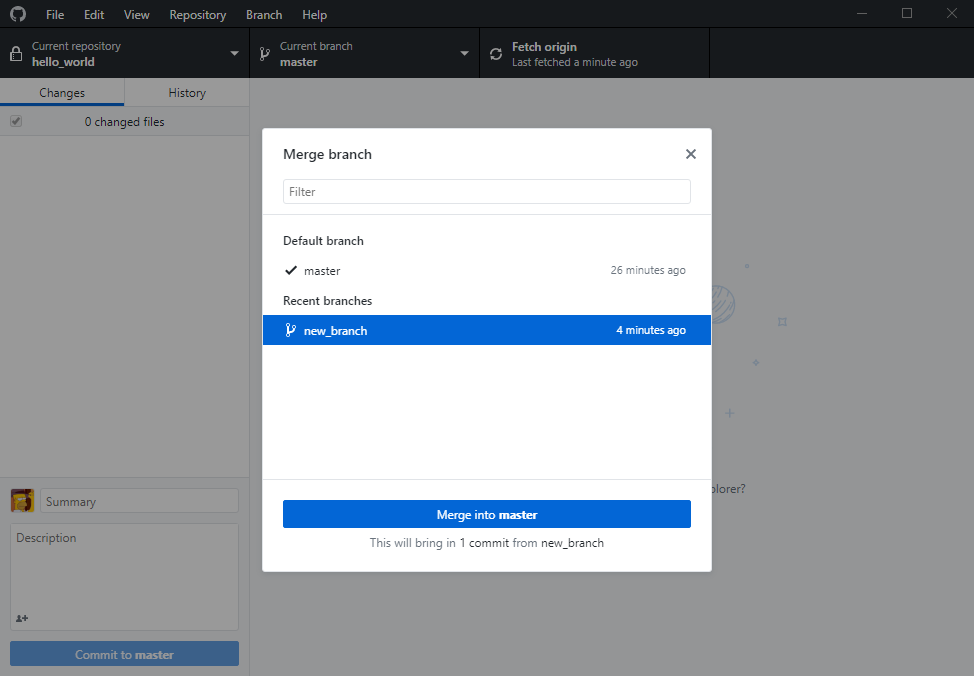\
\
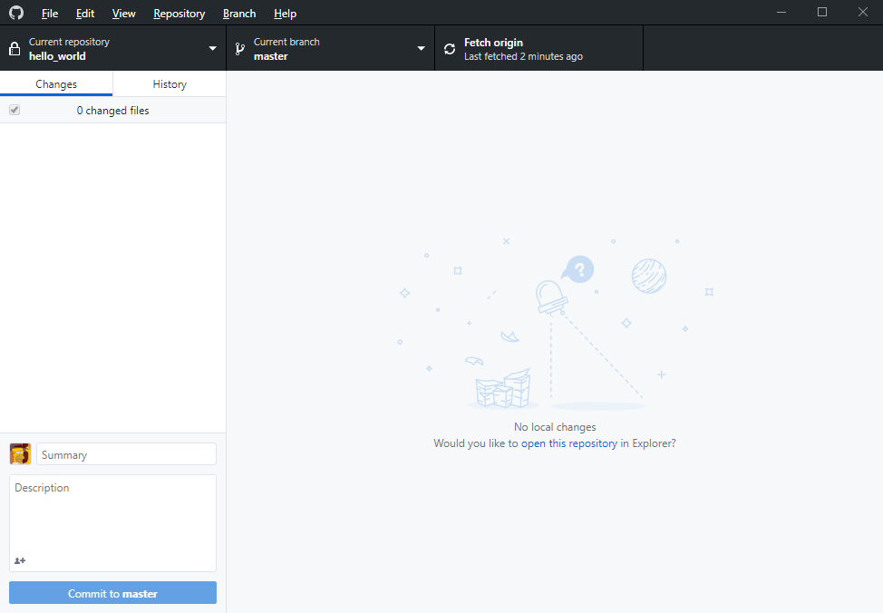

Collaboration
=============

Github allows you to collaborate with people in a highly efficient way.
To demonstrate this, go to “Repository”, then select “View on Github”.
Once the page loads, notice that the README.md is rendered as HTML, then
navigate to “Settings”, then to “Collaborators”. Invite your lab partner
to collaborate on your repository.\
\
\
\
\
\
\
Accept the invitation your partner has sent you, and edit their
repository directly on Github.com; specifically, add your own name to
their README. Commit these changes directly to the master branch. Once
your partner has done the same to your repo, fetch the changes from
Github. On your own machine, you should now select “Pull origin”. Your
partners’ name in now in your own README.\
\
\
\
\
\
In the background, Git handled the file combination in a way that was
non-destructive; by default, Git will always **try** to do this. In
practice, there will be times when pulling changes will force
*destructive* changes to be made. When this happens, Git will, most
likely, prompt you with a “Merge Conflict” warning, do not panic if this
happens, Git is only trying to save your own code.

Wrapping up
===========

To submit this lab, you’ll need to generate a Git Log. To do this,
select “Repository”, then select “Open in Command Prompt”. This will
prompt you to install Git, if the program cannot find Git on your
system. If you do not have Git installed, take a moment to do so now,
you will need it to submit your work for this lab.\
\
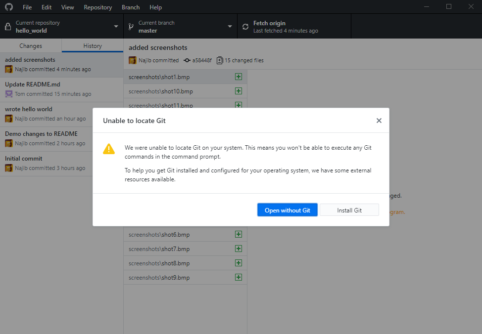\
\
\
Once Git is installed, reboot the Github Application, then hit the “Open
in Command Prompt” button once again, this should open up a new command
prompt set to the appropriate location.\
\
Now, run the command `git log`, and examine the output. Once you are
satisfied that this is the proper Git Log, hit the key ’q’ to quit.
Looking at the command prompt output is well and good, but it is much
more useful to have this output be written to a log. To do so, run the
command `git log >> log.txt`, and look at the contents of your repo. You
should see a file called “log.txt”, which contains the `git log` of the
repo, “piped” into the file.\
\
Commit the *log.txt* file to your **master branch**.

Submission
==========

Submit the README.md, and the log.txt file to Mimir.

In case of fire:
================

1.  `git commit -a`

2.  `git push`

3.  `leave building`
